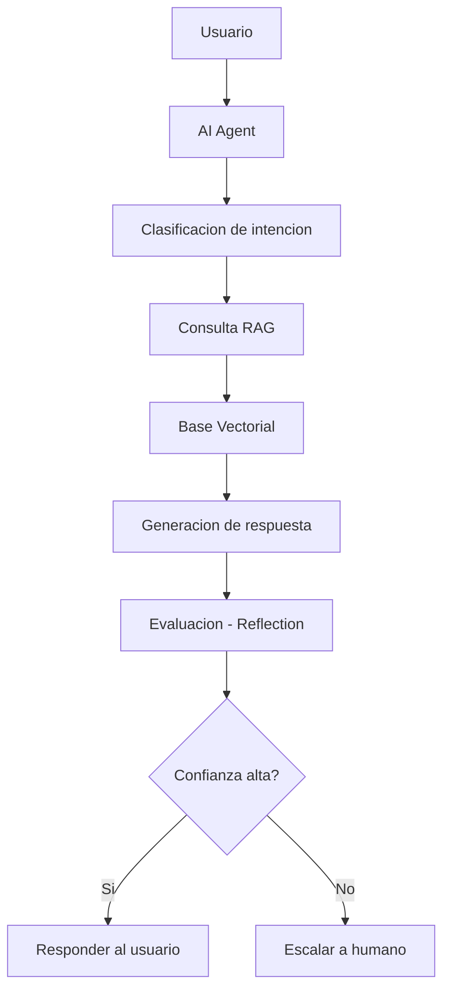

# EcoMarket AI Agent

## Sistema Inteligente de Atención al Cliente con RAG + Agentic Workflow

---

## Descripción General

Este proyecto implementa un sistema avanzado de atención al cliente para un entorno de e-commerce (EcoMarket), basado en **IA generativa**, integrando:

* **RAG (Retrieval-Augmented Generation)**
* **AI Agents (toma de decisiones autónoma)**
* **Reflection Process (mejora continua)**

El sistema no solo responde preguntas, sino que **analiza, decide y actúa**, simulando el comportamiento de un agente inteligente en un entorno organizacional real.

---

## Objetivo del Sistema

Desarrollar una solución que:

* Minimice las alucinaciones del modelo
* Mejore la precisión de las respuestas
* Automatice la atención al cliente
* Implemente toma de decisiones autónoma
* Escale solicitudes cuando sea necesario

---

## Arquitectura del Sistema

### 🔷 Diagrama del flujo (Agentic Workflow)




---

## Enfoque Multi-Agente (Diferencial)

El sistema puede extenderse a múltiples agentes especializados:

| Agente              | Función                          |
| ------------------- | -------------------------------- |
|    Agent Core       | Orquesta el flujo                |
|    Retrieval Agent  | Consulta la base de conocimiento |
|    Generator Agent  | Genera respuestas                |
|    Evaluator Agent  | Evalúa calidad                   |
|    Escalation Agent | Escala a humano                  |

---

## Tecnologías Utilizadas

* Python
* LangChain
* ChromaDB
* Sentence Transformers
* OpenAI API (opcional)
* Streamlit (interfaz)

---

## 🔹 Fase 1: Selección de Componentes

### Embeddings

`sentence-transformers/all-MiniLM-L6-v2`

✔ Open source
✔ Bajo costo
✔ Buen rendimiento en español

---

### Base Vectorial

**ChromaDB**

✔ Fácil integración
✔ Local / rápida
✔ Ideal para prototipos

---

## 🔹 Fase 2: Base de Conocimiento

### Documentos utilizados

* Políticas de devolución
* Inventario de productos
* FAQ
* Estado de pedidos

---

### Estrategia de Chunking

* Tamaño: 800 tokens
* Overlap: 100
* Segmentación por párrafos

---

## Implementación

### Instalación

```bash
pip install langchain chromadb sentence-transformers openai streamlit
```

---

### Ejecución

```bash
python src/rag_agent.py
```

---

## Interfaz (Streamlit)

```bash
streamlit run app.py
```

### Ejemplo:

* Usuario escribe pregunta
* Sistema responde en tiempo real
* Simula chatbot inteligente

---

## Lógica del Agente

```python
def agente_respuesta(pregunta):
    respuesta = rag_chain.run(pregunta)
    
    if "no tengo información" in respuesta.lower():
        return "Escalando a soporte humano..."
    
    return respuesta
```

---

## Reflection Process

El sistema implementa:

* Autoevaluación
* Detección de errores
* Mejora continua

---

## Métricas de Evaluación

Para validar el sistema:

| Métrica               | Descripción                 |
| --------------------- | --------------------------- |
| Accuracy              | Precisión de respuestas     |
| Relevancia            | Calidad de la información   |
| Latencia              | Tiempo de respuesta         |
| Tasa de escalamiento  | % de consultas no resueltas |
| Satisfacción simulada | Evaluación del usuario      |

---

## Ejemplos de Uso

### Entrada

```
¿Cuál es la política de devoluciones?
```

### Salida

```
Los productos pueden devolverse dentro de los 30 días...
```

---

## Limitaciones

* Datos simulados
* No despliegue en producción
* Dependencia del modelo
* Recursos limitados

---

## Impacto Organizacional

* Reducción de costos operativos
* Mejora en tiempos de respuesta
* Escalabilidad del servicio
* Mejora en experiencia del cliente

---

## Conclusiones

Este proyecto demuestra cómo la integración de **RAG + AI Agents + Workflows autónomos** permite evolucionar de chatbots tradicionales a sistemas inteligentes capaces de tomar decisiones y adaptarse al entorno.

---

## Estructura del Proyecto

```
ecoMarket-agent/
│
├── README.md
├── app.py
├── data/
├── src/
│   └── rag_agent.py
├── requirements.txt
```

---

## Diferenciales del Proyecto

✔ Arquitectura Agentic
✔ Sistema RAG robusto
✔ Control de alucinaciones
✔ Escalamiento inteligente
✔ Evaluación del sistema
✔ Interfaz interactiva

---

## Autor

Juan Manuel Hurtado Angulo / Manuel Alberto González González / Willian Alberto Reina García  
Maestría en Inteligencia Artificial Aplicada
Universidad ICESI

---

## Docente

David Miguel Ávila Crúz. MSc
asignatura: IA Generativa
